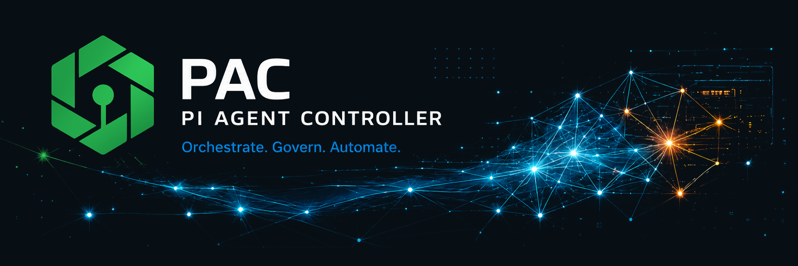
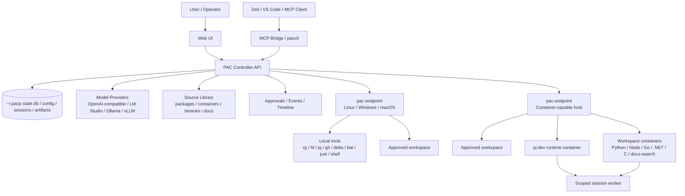
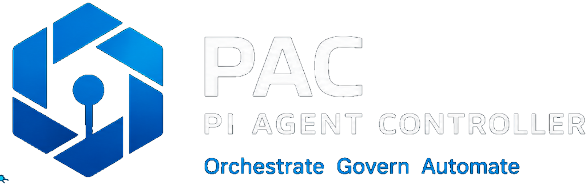
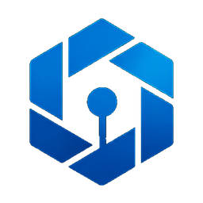
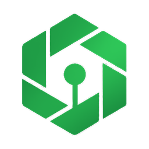

<p align="center">
  
</p>

# PAC - Pi Agent Control

PAC is a local-first, distributed agent control platform for running AI-assisted development, operations, documentation and automation sessions across trusted machines.

The controller provides the Web UI, API, session state, model/provider configuration, approvals, artifacts, source management and endpoint orchestration. Endpoints provide the actual execution environments: local binaries, approved workspaces, containerized coding sessions and pi.dev runtime integration.

PAC is designed for environments where work should be observable, auditable and routed to the right machine instead of blindly executed wherever the chat UI happens to run.

---

## What PAC Does

PAC gives you a control plane for agent-backed work:

- Start sessions from the Web UI, IDE integrations, MCP clients or automation.
- Select a profile, model, workspace, endpoint and execution mode per session.
- Route work to Linux, Windows, macOS or container-capable endpoints.
- Expose endpoint-local tools such as `rg`, `fd`, `jq`, `git`, `delta`, `bat` and `just` to agents.
- Run tasks directly on endpoints, inside containers, or through the pi.dev runtime container.
- Keep task events, approvals, artifacts, logs, timelines and source diffs visible in one place.
- Manage model providers such as OpenAI-compatible APIs, LM Studio, Ollama and vLLM without making the PAC controller a model host.
- Maintain customer, user, workspace and profile context for repeatable sessions.

---

## Product Ideology

PAC follows a few strong design rules.

### Local-first control

PAC keeps its default state in `~/.pacp`, including configuration, sessions, workspaces, artifacts, logs, cache and runtime locks. The controller can be started from different directories without accidentally creating a second state tree.

### Controller coordinates; endpoints do the work

The controller is the authority for orchestration, state, policy and visibility. Heavy work belongs on endpoints or endpoint-launched containers. This keeps the controller predictable and prevents it from becoming an overloaded general-purpose compute node.

### Explicit execution boundaries

Sessions are tied to selected workspaces, endpoints, permission profiles and execution modes. Users and agents should be able to see where work runs, which tools are available, and what has changed.

### Tools are local binaries; plugins are skills around them

Endpoint tools are real binaries installed on the selected endpoint. Plugins and slash commands are lightweight routing or skill layers that decide how to use those binaries or when to invoke controller-side behavior.

### pi.dev is the runtime; PAC is the wrapper and control plane

PAC treats `pi`, `agent` and `harness` as the pi.dev runtime. PAC-specific code around it is called a PAC wrapper, endpoint wrapper, controller wrapper or PAC tooling.

### Auditable automation

Approvals, task events, structured timelines, artifacts, diffs, endpoint jobs and source operations are surfaced through the controller so the user can inspect what happened and why.

### Bring your own model provider

PAC does not host language models itself. It routes to configured providers such as OpenAI-compatible endpoints, LM Studio, Ollama or vLLM, using declared model capabilities and context profiles.

---

## Architecture Overview



---

## Main Components

### Controller

The controller is the central PAC service. It is implemented as a Python FastAPI application and serves both the API and the Web UI.

Responsibilities include:

- Session creation and lifecycle management.
- Endpoint registration, heartbeat and job routing.
- Model and provider registry.
- Context profile and permission profile management.
- Workspace and source-context resolution.
- Approvals, audit events and timeline cards.
- Artifact upload, indexing and download.
- Source library browsing and package build actions.
- TLS, mDNS, local service and setup handling.
- Update archive, local diff and restore workflows.

Important paths:

```text
pi_agent_platform/api/main.py       Main API and Web UI server
pi_agent_platform/core/             Core services and orchestration logic
pi_agent_platform/web/              Browser UI assets
config/example.config.yaml          Default configuration shape
deploy/                             Container and reverse-proxy deployment examples
```

### Web UI

<p align="center">
  
</p>

The Web UI is the operator console for PAC. It contains grouped navigation for operating, building, agent configuration, administration and observation.

Major UI areas include:

- **Dashboard**: current state across sessions, endpoints, providers, controller runtime and recent events.
- **Sessions**: chat-style session workspace with model, endpoint and execution controls.
- **Endpoints**: endpoint inventory, endpoint wizard, onboarding token generation and install-kit output.
- **Models and Providers**: configured models, live provider inventory, provider tests and model adaptation guidance.
- **Sources**: source tree, package sources, binary/container build actions, feature packs and source archives.
- **Approvals**: pending task and access approvals.
- **Settings**: server, TLS, authentication, controller runtime and update settings.
- **Events rail**: recent platform and session activity.

### Endpoints

Endpoints are machines that PAC can route work to. The primary endpoint binary is `pac-endpoint`.

An endpoint can:

- Register identity and labels with the controller.
- Send heartbeat and capability information.
- Report available tools and package capability groups.
- Execute controller-queued jobs in an approved workspace.
- Run with command execution enabled or disabled through `PAC_RUNNER_ENABLED`.
- Use optional TLS client certificates.
- Receive maintenance and self-update jobs.
- Support container-backed and pi.dev-backed execution when local runtimes are available.

Important endpoint sources:

```text
binaries/pac-endpoint/              Main endpoint wrapper and embedded runner
binaries/pac-endpoint-runner/       Compatibility source for older runner references
scripts/install-runner.sh           Endpoint install helper
```

### Endpoint Tool Bridge

PAC exposes endpoint tools as named tool jobs rather than forcing every action through raw shell commands.

Common tools:

| Tool | Purpose |
| --- | --- |
| `rg` / ripgrep | Search text quickly inside a workspace. |
| `fd` | Find files and directories. |
| `jq` | Process JSON. |
| `git` | Inspect and manipulate repositories. |
| `delta` | Render readable diffs. |
| `bat` / `batcat` | Preview files. |
| `just` | Run project recipes. |
| `shell` | Run controlled shell commands when allowed. |

Slash commands such as `/rg`, `/fd`, `/jq`, `/git`, `/delta`, `/bat`, `/just`, `/compact` and `/subagent` build on this model. Endpoint commands run on the locked session endpoint and inside the session workspace.

### pi.dev Runtime Integration

PAC can bootstrap and supervise a local pi.dev runtime through PAC wrappers and a dedicated runtime container.

The controller can prepare:

- A local `local-PAC` endpoint.
- The controller wrapper binary at `~/.pacp/bin/pac-endpoint`.
- The pi.dev runtime container image.
- The `agent-control` workspace.
- A managed controller session using the configured profile and model.

The runtime container source lives in:

```text
containers/pi-agent-harness/
```

### Workspace Containers

PAC ships purpose-built workspace containers for repeatable endpoint/container sessions.

| Container | Purpose |
| --- | --- |
| `python-dev` | Python 3 development with `uv`, `pytest` and code search tools. |
| `node-dev` | Node.js, npm, pnpm and TypeScript-oriented tooling. |
| `go-dev` | Go development, formatting and code review tooling. |
| `dotnet-dev` | .NET SDK environment for C# and .NET workloads. |
| `c-dev` | C/C++ development with GCC, GDB, CMake and search tools. |
| `docs-search` | Documentation and repository search environment. |
| `mcp-builder` | Builder source for MCP/client binaries. |
| `pi-agent-harness` | Isolated pi.dev runtime container. |

Container sources live under:

```text
containers/
```

### CLI and Integration Binaries

PAC includes small Go binaries for endpoint, IDE and automation integration.

| Binary | Role |
| --- | --- |
| `pac-endpoint` | Turns a host into a PAC endpoint and optionally executes queued jobs. |
| `pac-agent` | PAC-side wrapper around pi.dev runtime integration. |
| `pacctl` | Lightweight CLI for IDE helpers, containers and endpoint workflows. |
| `zed-binary` | Packaged helper for Zed context-server integration. |
| `pac-mcp-go` | MCP stdio bridge that forwards MCP tool calls to a PAC server. |

Relevant paths:

```text
binaries/
mcp/pac-mcp-go/
vscode-extension/
docs-zed-mcp-example.json
```

### Source Library

The source library is how PAC keeps package, binary, container and documentation sources visible and buildable from the controller.

It contains:

- Component metadata through `pac-component.json` files.
- Binary build sources.
- Container build sources.
- Documentation packages.
- Feature-pack inspection and apply workflows.
- Online update and release package support.
- Binary artifact storage and download APIs.

### Configuration and Profiles

The default configuration supports:

- Controller host, port and public URL.
- TLS certificate generation and local CA handling.
- mDNS publication as `admin.pac.local`.
- User-mode or service-mode operation.
- Optional dev-token authentication.
- Provider definitions for OpenAI-compatible APIs, LM Studio, Ollama and vLLM.
- Context profiles from small 4k sessions to large-context profiles.
- Tool packages and endpoint tool definitions.
- Plugin definitions for Python helper scripts, slash-command routing, context compaction and subagent tasks.
- Workspace profiles and execution defaults.
- Endpoint/runtime defaults.

Primary config file:

```text
config/example.config.yaml
```

---

## Infrastructure Build

### Runtime stack

PAC is built around:

- **Python 3.9+** application package.
- **FastAPI** API server.
- **Uvicorn** ASGI runtime.
- **Pydantic** models and validation.
- **PyYAML** configuration handling.
- **HTTPX** provider and HTTP integration.
- **Zeroconf** for mDNS service publication.
- **Cryptography** for TLS and certificate workflows.
- **Go** for endpoint, CLI and MCP helper binaries.
- **Podman or Docker** for controller deployment, endpoint workspace containers and the pi.dev runtime container.

### Default state layout

```text
~/.pacp/
  config/
    config.yaml
    tls/
  state.db
  workspaces/
  sessions/
  artifacts/
  logs/
  cache/
  run/
    server.lock
  app/
  bin/
```

### Deployment options

PAC includes multiple deployment paths:

| Path | Files | Use case |
| --- | --- | --- |
| Local install | `install.sh` | Install and run PAC directly on a host. |
| Development run | `scripts/dev-run.sh` | Run the API/UI during development. |
| Container image | `deploy/Containerfile` | Build the controller as a container image. |
| Compose | `deploy/compose.yaml` | Basic containerized controller deployment. |
| Podman compose | `deploy/compose.podman.yaml` | SELinux-friendly Podman deployment. |
| Traefik compose | `deploy/compose.traefik.yaml` | Public HTTPS exposure with Traefik and Let’s Encrypt. |
| Endpoint install | `scripts/install-runner.sh` | Install a remote endpoint wrapper. |
| MCP bridge build | `scripts/build-mcp-bridge.sh` | Build MCP helper binaries. |

### CI and release workflows

The repository contains GitHub workflow definitions for:

- Building PAC release packages.
- Generating PAC diff releases.
- Applying validated diff PRs.
- Seeding package sources.

Relevant files:

```text
.github/workflows/pac-release.yml
.github/workflows/pac-diff-release.yml
.github/workflows/apply-diff-pr.yml
.github/workflows/seed-packages.yml
```

The release tooling also produces manifests, changelog metadata and update diff artifacts.

---

## Session Flow

A normal PAC-backed session works like this:

1. A user starts a session from the Web UI, an IDE, MCP, `pacctl` or automation.
2. PAC resolves the selected profile, workspace, source context and permission profile.
3. PAC selects or locks an endpoint for the session.
4. The controller chooses the model/provider configuration for the session.
5. The endpoint executes allowed tool calls in the selected workspace.
6. If requested, the endpoint starts a workspace container or pi.dev runtime container.
7. Events, approvals, task output, timeline cards and artifacts flow back to the controller.
8. The user reviews state, diffs, logs and artifacts from the UI or integration client.

---

## Quick Start

Install locally:

```bash
./install.sh
```

Open the configured UI, commonly:

```text
https://admin.pac.local
https://localhost
```

Run manually during development:

```bash
python3 -m venv .venv
. .venv/bin/activate
pip install -e .
cp config/example.config.yaml config/config.yaml
uvicorn pi_agent_platform.api.main:app --host 0.0.0.0 --port 443
```

Build the pi.dev runtime container:

```bash
scripts/build-pi-container.sh localhost/pi-agent-harness:stage11
```

Install an endpoint:

```bash
sudo CONTROL_PLANE=https://admin.pac.local \
  PI_AGENT_TOKEN=change-me \
  PI_CONTAINER_IMAGE=localhost/pi-agent-harness:stage11 \
  scripts/install-runner.sh
```

---

## Repository Map

```text
.github/workflows/                 Release, diff and package workflows
binaries/                          Go binaries for endpoint, CLI and IDE/MCP helpers
config/                            Example controller configuration
containers/                        Workspace, builder and pi.dev runtime containers
deploy/                            Container, Compose, Podman and Traefik deployment files
docs/                              Technical, endpoint, runtime and integration documentation
mcp/                               MCP stdio bridge source
pi_agent_platform/api/             FastAPI controller and route definitions
pi_agent_platform/core/            Controller services, state, runtime and orchestration logic
pi_agent_platform/web/             Web UI, styles and brand assets
scripts/                           Build, install, validation and release helper scripts
vscode-extension/                  VS Code integration scaffold
```

---

## Brand Assets

<p align="center">
  
  &nbsp;&nbsp;&nbsp;
  
</p>

The README references assets already shipped with the product under:

```text
pi_agent_platform/web/assets/
```

Useful assets include:

- `pac-banner-green.png`
- `pac-logo-lockup-transparent.png`
- `pac-logo-compact-transparent.png`
- `pac-brand-mark-transparent-*.png`
- `pac-icon-green-*.png`
- `pac-icon.svg`
- `pac-loader.svg`

---

## Current Product Shape

PAC is a controller-driven platform for agent sessions, endpoint orchestration, model-provider routing, source/package management and observable execution. Its strongest architectural boundary is the split between control and execution:

- The **controller** owns orchestration, state, policy, UI and auditability.
- **Endpoints** own local execution, tools, workspaces and host/container capabilities.
- **Containers** provide isolated and repeatable workspaces.
- **pi.dev** provides the agent runtime, wrapped and supervised by PAC.
- **Providers** supply model inference externally.

That separation makes PAC suitable for multi-machine development, operational automation, customer-scoped documentation work, controlled code execution and IDE-integrated agent workflows.
